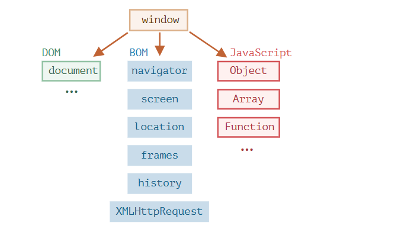
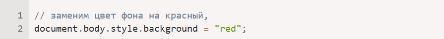

# Что это DOM в JavaScript

Объектная модель документа (DOM) - это программный интерфейс для веб-документов. Она представляет структуру документа в виде дерева объектов, позволяя разработчикам манипулировать содержимым, структурой и стилем веб-страницы с помощью JavaScript

DOM представляет собой программный интерфейс для веб-документов, который предоставляет структурированное представление HTML-документа. Он позволяет разработчикам взаимодействовать с содержимым веб-страницы, изменять элементы, атрибуты и стили.

Объект document – основная «входная точка». С его помощью мы можем что-то создавать или менять на странице.

Например:

Мы использовали в примере только document.body.style, но на самом деле возможности по управлению страницей намного шире.

* DOM – не только для браузеров
Спецификация DOM описывает структуру документа и предоставляет объекты для манипуляций со страницей. Существуют и другие, отличные от браузеров, инструменты, использующие DOM.

Например, серверные скрипты, которые загружают и обрабатывают HTML-страницы, также могут использовать DOM. При этом они могут поддерживать спецификацию не полностью.

* CSSOM для стилей
Правила стилей CSS структурированы иначе чем HTML. Для них есть отдельная спецификация CSSOM, которая объясняет, как стили должны представляться в виде объектов, как их читать и писать.

CSSOM используется вместе с DOM при изменении стилей документа. В реальности CSSOM требуется редко, обычно правила CSS статичны. Мы редко добавляем/удаляем стили из JavaScript, но и это возможно.

# Что это BOM в JavaScript
Объектная модель браузера (BOM) - это программный интерфейс для веб-браузеров. Она представляет окно браузера и позволяет разработчикам взаимодействовать с самим браузером, а не с содержимым веб-страницы.

